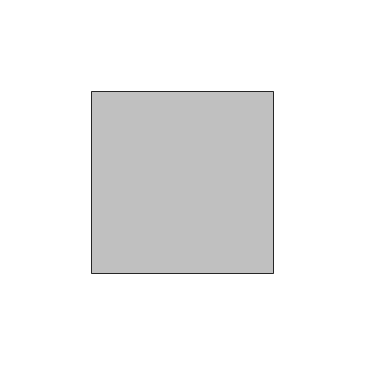
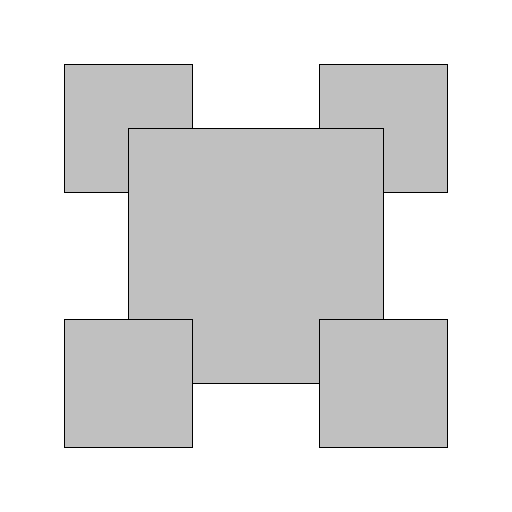
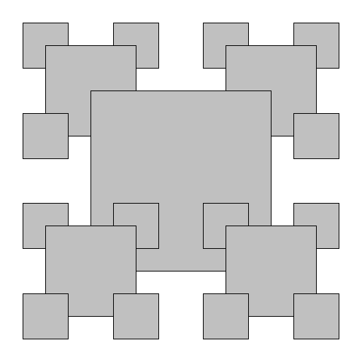

# RecursiveSquares

This Java program generates a recursive pattern of squares using `StdDraw`. It takes an integer `n` as a command-line argument, which determines the depth of recursion.

## **Features**
- Uses recursion to draw nested squares.
- Employs the `StdDraw` library for graphical output.
- Demonstrates fundamental recursion principles in computer graphics.

## **Prerequisites**
- Java Development Kit (JDK) installed.
- `stdlib.jar` (which contains `StdDraw`) added to the classpath.

## **How to Compile and Run**
1. **Compile the program**:
   ```sh
   javac -cp .:stdlib.jar RecursiveSquares.java

	2.	Run the program:

java -cp .:stdlib.jar RecursiveSquares <n>

where <n> is the recursion depth (e.g., java -cp .:stdlib.jar RecursiveSquares 4).

Example Output

Below are sample outputs of the recursive square pattern at different depths:

<p align="center">
  
  
  
  
  
</p>


Understanding the Code
	•	drawSquare(double x, double y, double length): Draws a square at (x, y) with the given side length.
	•	draw(int n, double x, double y, double length): Recursively draws smaller squares at the corners of each square.
	•	main(String[] args): Parses the recursion depth and initiates the drawing process.

License

This project is open-source under the MIT License.
